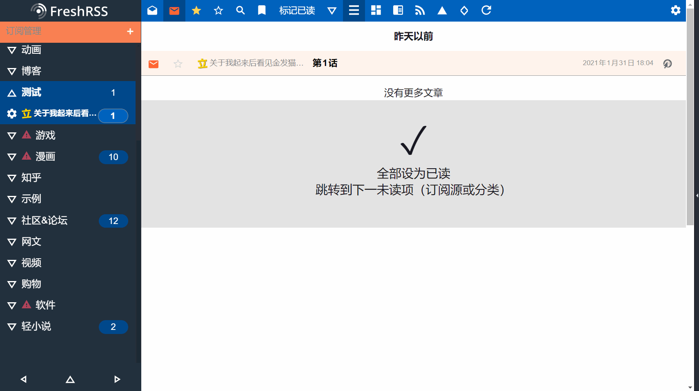
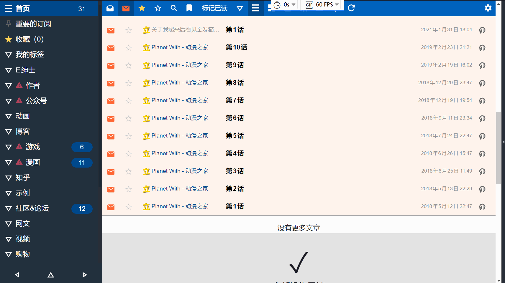

# FreshRSS-extensions

xExtension-ShowFeedTitle  
光标停在订阅项目上时，弹出气泡提示

禁用扩展时的效果(disable extesion)

启用扩展时的效果(enable extesion)

xExtension-ScrollToSelectedFeed  
选中某个订阅项目时，页面自动滚动到项目

禁用扩展时的效果(disable extesion)

启用扩展时的效果(enable extesion)

